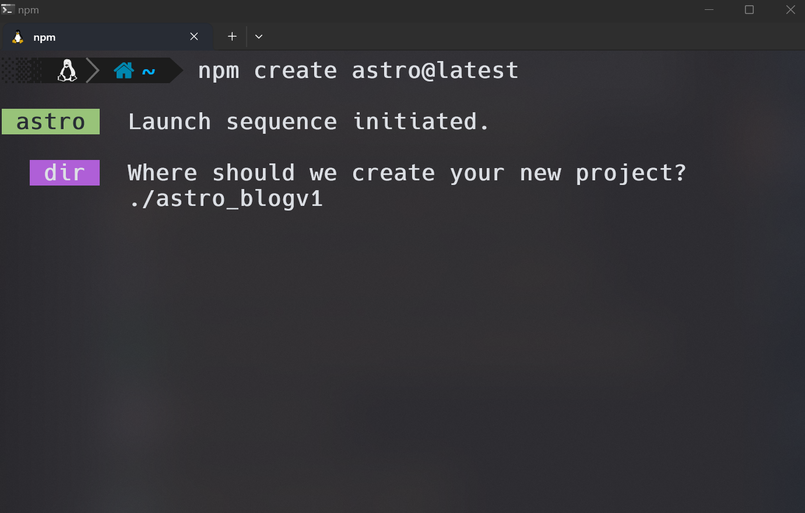
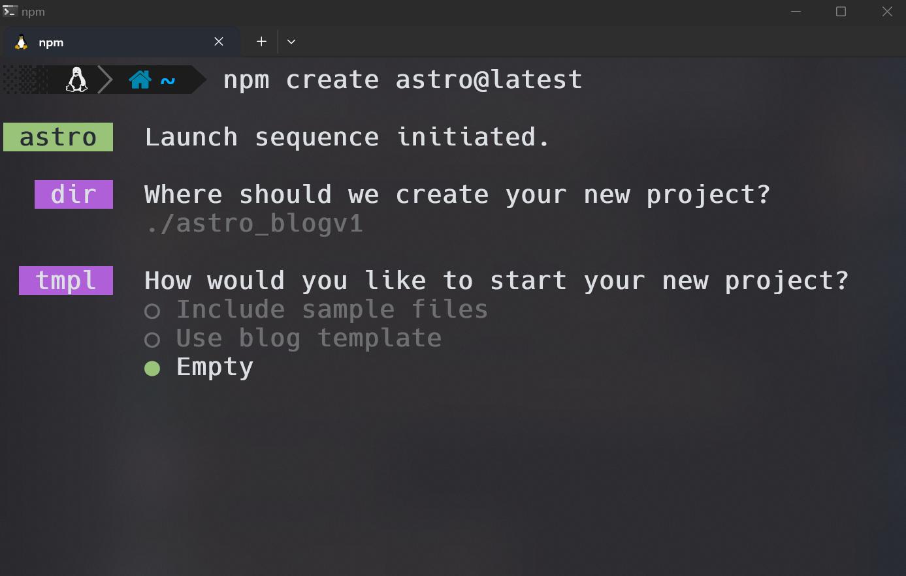
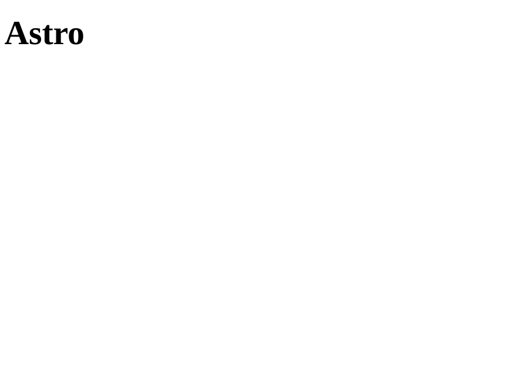

# Intro

Developers in search of a framework renowned for its superb documentation may find Astro to be a benchmark in this regard.
- <a href="https://docs.astro.build/en/getting-started/" target="_blank" rel="noopener noreferrer">Astro Docs</a>

This article will guide you through the <a href="https://docs.astro.build/en/getting-started/" target="_blank" rel="noopener noreferrer">Build a Blog</a> tutorial, `showcasing a reliable method for crafting a high-performance and impactful blog`. Astro's tutorial is structured into six comprehensive lessons, which I will summarize and explain in detail.

<ul style="list-style-type: none;">
    <li>🌐 Create and deploy our first Astro site</li>
    <li>😎 Add style and link to pages on the site</li>
    <li>🛠️ Build and design with Astro UI components</li>
    <li>♻️ Save time and energy with reusable page layouts</li>
    <li>📈 Beef up our blog</li>
    <li>⛵ Set sail with Astro islands</li>
</ul>

This tutorial guide is designed to not only assist new developers through their initial steps in coding but also to serve as a personal refresher on essential concepts, thereby enhancing my skills. Beyond empowering individuals to start developing with confidence and dispelling the fears associated with taking the first step, it ensures `participants will conclude with a fully functioning blog`. This blog, ripe for further development, feature additions, and style customization, represents something tangible—a creation stored in computer memory but vividly visible on their screens for their eyes to appreciate. It's a journey that promises a dual benefit: instilling confidence in beginners and offering a practical, extendable project to showcase their newfound skills.
# Setup Requirements
- Terminal
- <a href="https://docs.astro.build/en/getting-started/" target="_blank" rel="noopener noreferrer">Node.js</a> (v18.14.1 or later)
- <a href="https://code.visualstudio.com/#alt-downloads" target="_blank" rel="noopener noreferrer">Code Editor</a>
- <a href="https://github.com/" target="_blank" rel="noopener noreferrer">GitHub</a>

# 🌐 Create and deploy our first Astro site
#### Launch the Astro setup wizard
```
npm create astro@latest
```
The prompt asks where to create your new project? Type `./astro_blogv1` and press enter.



Use the down arrow to select `Empty` project and press enter.



When the prompt asks, “Would you like to install dependencies?” type `y`.

When the prompt asks you if you plan on writing TypeScript, type `n`.

When the prompt asks, “Would you like to initialize a new git repository?” type `y`.

Once the setup wizard is complete, step into the project directory and VS Code.

#### Run Astro in dev mode
```
./astro_blogv1
code .
```
Once in VS Code, navigate to the integrated terminal `ctrl + shift + p`

Start the dev server.
```
npm run dev
```
Open http://localhost:4321 in your browser. Here's how the website looks.



# 😎 Add style and link to pages on the site
The

# 🛠️ Build and design with Astro UI components
The

# ♻️ Save time and energy with reusable page layouts
The

# 📈 Beef up our blog
The

# ⛵ Set sail with Astro islands
The

