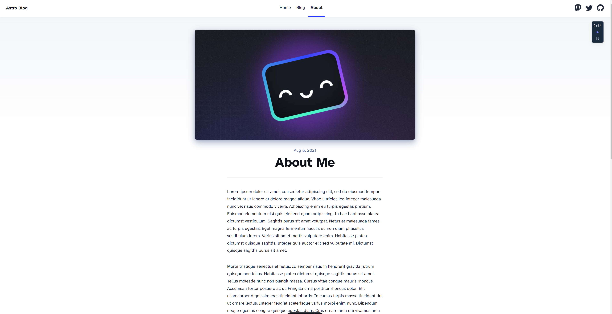
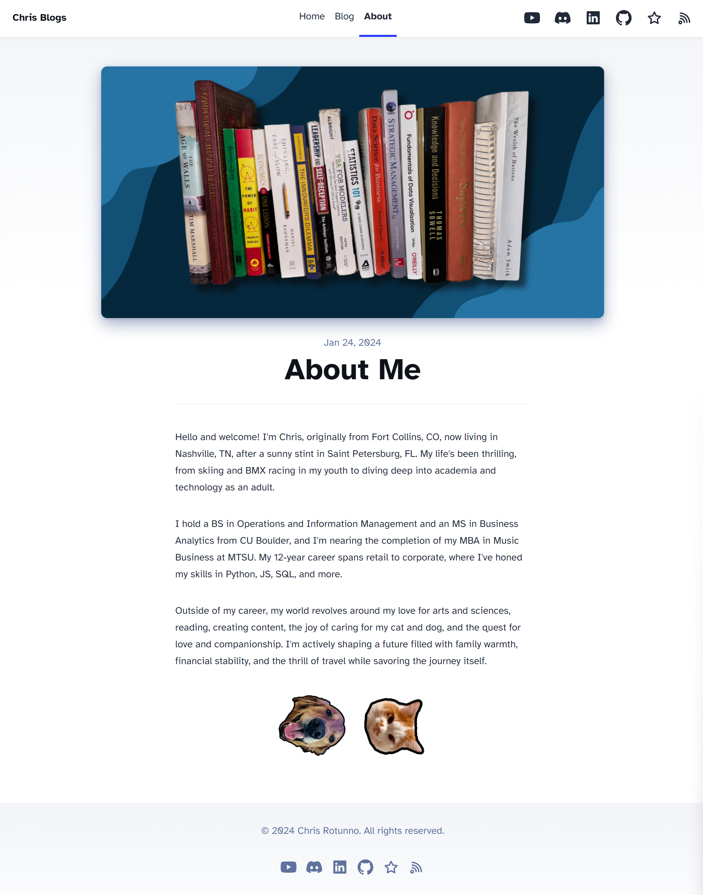
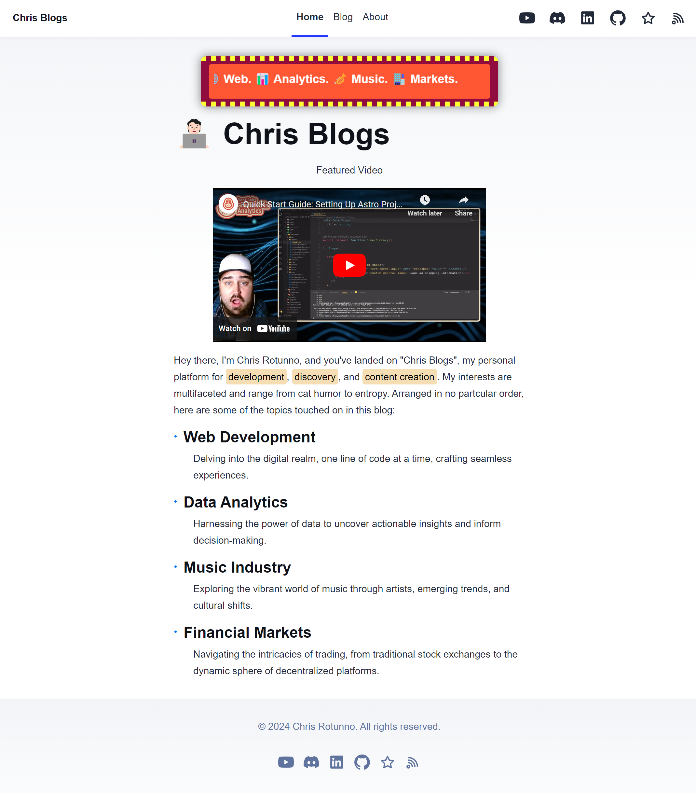
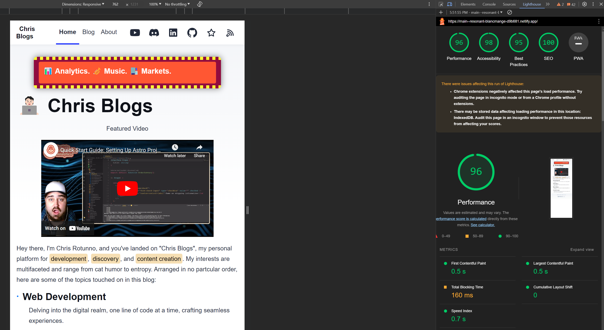
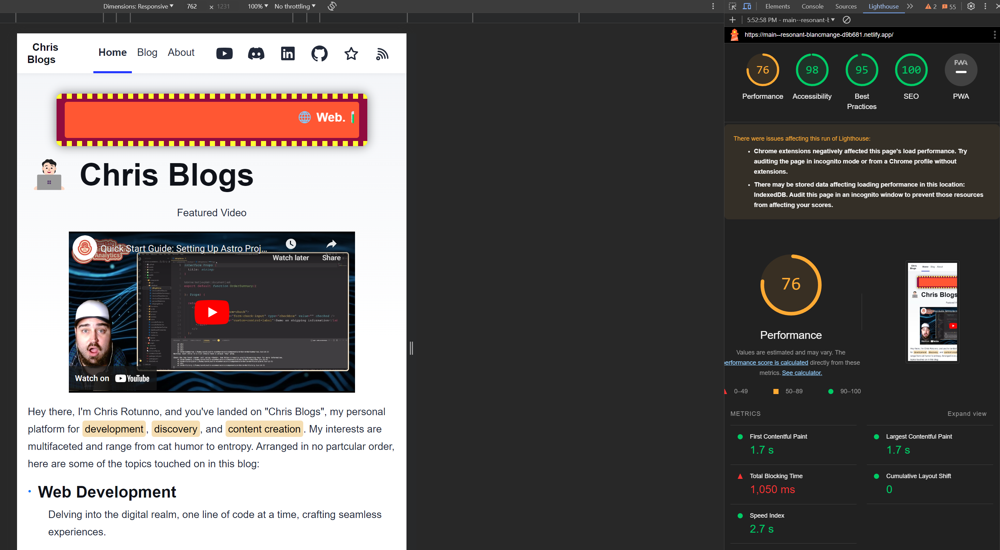

Right off the bat, I have to say, my developer experience with Astro has been outstanding! Although I'm just beginning to explore its depths, my interactions in the Discord server have been remarkable, with prompt and helpful responses from the community. Additionally, transitioning from React, I've found the adoption process to be quite smooth. The similarities in concepts and structure have made it easier to get accustomed to the new environment.

# Part I: Creating The Project

I began developing my first Astro project by entering this command in my terminal.
```
npm create astro@latest
```
Of course, I had already installed the right node version (v18.14.1 or higher) and opened up my editor and terminal, which are prerequisites for any Astro project.

Astro's Command Line Interface (CLI) guided me through the initial setup, asking me to name the project and handle the dependencies installation. Additionally, it offered the choice to initiate with a blog template. This template would serve as a pre-configured foundation for the project, offering a well-structured starting point for web development and design, effectively streamlining the building process.


What's unique about this project is its features:

- ✅ Minimal styling
- ✅ 100/100 Lighthouse score
- ✅ SEO-friendly
- ✅ Sitemap support
- ✅ RSS Feed
- ✅ Markdown & MDX support
 
Right from the start, Astro provided me with a user-friendly sandbox environment. This setup allowed me to experiment and learn, requiring minimal expertise in HTML, CSS, or JavaScript. I quickly had my initial project up and running, accessible at http://localhost:4321/.

<hr style="border: none; height: 10px; background: linear-gradient(to right, #f06, #a2d); border-radius: 5px;" />


<hr style="border: none; height: 10px; background: linear-gradient(to right, #f06, #a2d); border-radius: 5px;" />




<hr style="border: none; height: 10px; background: linear-gradient(to right, #f06, #a2d); border-radius: 5px;" />


# Part II: Astro Blog Template

As I navigated back to **VS Code**, I began to investigate the project structure. Here's the file tree I found in the `src` folder.
```plaintext
┣ 📂components
┃ ┣ 📜BaseHead.astro
┃ ┣ 📜Footer.astro
┃ ┣ 📜FormattedDate.astro
┃ ┣ 📜Header.astro
┃ ┗ 📜HeaderLink.astro
┣ 📂content
┃ ┣ 📂blog
┃ ┃ ┣ 📜first-post.md
┃ ┃ ┣ 📜markdown-style-guide.md
┃ ┃ ┣ 📜second-post.md
┃ ┃ ┣ 📜third-post.md
┃ ┃ ┗ 📜using-mdx.mdx
┃ ┗ 📜config.ts
┣ 📂layouts
┃ ┗ 📜BlogPost.astro
┣ 📂pages
┃ ┣ 📂blog
┃ ┃ ┣ 📜[...slug].astro
┃ ┃ ┗ 📜index.astro
┃ ┣ 📜about.astro
┃ ┣ 📜index.astro
┃ ┗ 📜rss.xml.js
┣ 📂styles
┃ ┗ 📜global.css
┣ 📜consts.ts
┗ 📜env.d.ts
```

Components Folder (`components`):

Immediately noticeable in the Astro template is the components folder. It's a collection of essential UI elements like headers, footers, and other reusable components. This setup reflects Astro’s approach to organizing key parts of a website for efficient reuse and modular development.

Content Management (`content`):

The content folder is next in line, hosting all blog posts in Markdown format. This clear separation of content from the layout underscores Astro's philosophy of maintaining an organized and manageable structure, enhancing the ease of content creation and maintenance.

Layout Templates (`layouts`):

In the layouts folder, there's a specific file, such as BlogPost.astro, serving as a reusable layout template. This template provides a consistent structure for blog pages, allowing for customization and flexible design adaptations.

Page Structure (`pages`):

Diving into the pages directory reveals individual .astro files for different sections of the site, like the landing page (index.astro) and an 'about' page (about.astro), along with a blog folder for blog-specific pages.
Each Astro page file integrates three core components:
1. **Front Matter**: For metadata and script logic.
2. **HTML/JSX Markup**: The primary content area, blending HTML with dynamic JSX.
3. **Styling**: Scoped CSS within the same file or imported from external sources.

Styles Folder (`styles`):

The styles folder contains global styling files, like global.css. This is where you define CSS styles that apply across your entire site. Having a dedicated folder for styles helps in maintaining a clean and organized codebase, making it easier to manage and update your website's look and feel.

TypeScript Files (`consts.ts` and `env.d.ts`):

The consts.ts file stores constants like site settings, aiding in code reusability. The env.d.ts file, for TypeScript, ensures proper use of environment variables. While not essential right now, both files are useful for future scalability and code organization.

# Part III: Building Off The Template
#### About Page
After getting the blog template operational, the next step was to infuse it with my personal touch. Where better to begin than with the 'About' page – narrating one's own story should be straightforward, shouldn't it? The template provided a manageable starting point. Here's the initial code I worked with:

```
//about.astro
---
import Layout from '../layouts/BlogPost.astro';
---

<Layout
	title="about.astro"
	description="Lorem ipsum dolor sit amet"
	pubDate={new Date('August 08 2021')}
	heroImage="/blog-placeholder-about.jpg">
	<p>
		Lorem ipsum dolor sit amet, consectetur adipiscing elit, sed do eiusmod tempor incididunt ut
		labore et dolore magna aliqua. Vitae ultricies leo integer malesuada nunc vel risus commodo
		viverra. Adipiscing enim eu turpis egestas pretium. Euismod elementum nisi quis eleifend quam
		adipiscing. In hac habitasse platea dictumst vestibulum. Sagittis purus sit amet volutpat. Netus
		et malesuada fames ac turpis egestas. Eget magna fermentum iaculis eu non diam phasellus
		vestibulum lorem. Varius sit amet mattis vulputate enim. Habitasse platea dictumst quisque
		sagittis. Integer quis auctor elit sed vulputate mi. Dictumst quisque sagittis purus sit amet.
	</p>
</Layout>

```

In the provided Astro template, the three core components of page structure as previously mentioned — Front Matter, Markup, and Styling — are represented as follows:

1. **Front Matter**: At the top, enclosed by ---, it imports the Layout component from ../layouts/BlogPost.astro. This section is used for script logic and importing necessary components.
2. **HTML/JSX Markup**: The page content is enclosed within the `<Layout>` tags, where properties like title, description, pubDate, and heroImage are set. The main content is a paragraph with placeholder text, illustrating the structure and content of the 'About' page.
3. **Styling**: Not shown in the snippet, styling in Astro can be done using inline styles in a `<style>` tag or via external CSS files. The Layout component likely handles common styling elements for the page.

Astro's streamlined framework allowed me to plug and play, updating necessary fields like the title, description, publication date, hero image, and paragraph `</p>` content. Here is my result after a little help from Canva for the cover image and pet graphics.


Refining the template was streamlined, thanks in part to assistance from ChatGPT. I enhanced the pet images with a rotation effect using CSS , which isn't visible in the screenshot. Embedding these images was done using a `<div>` element within the layout.

#### Landing Page
Transitioning from the About page to the landing page, I encountered a slightly elevated level of complexity, primarily due to the additional imports in the Astro template. The landing page structure was an expansion of the simpler About page, incorporating essential components like BaseHead, Header, and Footer from the ../components directory, alongside constants from ../consts.
The template, defined in index.astro, offered a fundamental but richly potential canvas:


```
//index.astro
---
import BaseHead from '../components/BaseHead.astro';
import Header from '../components/Header.astro';
import Footer from '../components/Footer.astro';
import { SITE_TITLE, SITE_DESCRIPTION } from '../consts';
---

<!doctype html>
<html lang="en">
    <head>
        <BaseHead title={SITE_TITLE} description={SITE_DESCRIPTION} />
        ...
    </head>
    <body>
        <Header title={SITE_TITLE} />
        <main>
            ...
        </main>
        <Footer />
    </body>
</html>
---
import BaseHead from '../components/BaseHead.astro';
import Header from '../components/Header.astro';
import Footer from '../components/Footer.astro';
import { SITE_TITLE, SITE_DESCRIPTION } from '../consts';
---

<!doctype html>
<html lang="en">
    <head>
        <BaseHead title={SITE_TITLE} description={SITE_DESCRIPTION} />
        ...
    </head>
    <body>
        <Header title={SITE_TITLE} />
        <main>
            ...
        </main>
        <Footer />
    </body>
</html>
```
While this required managing a few more elements, the process remained intuitive. My focus was on infusing the page with personal flair, notably through the addition of a dynamic billboard, text hilighting, and an embedded YouTube video. These enhancements, though not drastically complex, allowed me to explore more of the template's capabilities and further personalize the user experience on my website's primary entry point.




#### Blog Page


I was immediately satisfied with the template's preset layout, as previously outlined in the initial segment of this narrative. Consequently, I chose to preserve its design as-is, pivoting my focus towards the creation of blog content through MDX. This marked a significant milestone in my journey. The next steps involved establishing a repository and deploying the site on Netlify, thus transitioning from development to live deployment.

# Part IV: Deploying The Project With CI/CD


Having finalized my edits and achieved a satisfactory state with the project, the next logical step was to facilitate Continuous Integration and Deployment (CI/CD). To this end, I initiated a new repository on GitHub called "chris-blogs". This allowed me to utilize standard Git commands to seamlessly transfer my project to the repository. Here are the commands I used straight from the VS Code IDE:

```
//.bash
git init
git remote add origin https://github.com/towardsuffering/chris-blogs.git
git add .
git commit -m "first blog edit"
git push https://github.com/towardsuffering/chris-blogs.git
```

Following the successful upload of my project to GitHub, I logged into my Netlify account to initiate the deployment process. By linking to the GitHub repository, I was able to deploy the project on Netlify's Content Delivery Network (CDN). The deployment process was swift and efficient, resulting in the project being promptly accessible via a Netlify-provided generic URL.

The final touch involved associating a custom domain with the project, thereby enhancing its accessibility and professional appeal.

Concluding my development process, I conducted a Lighthouse audit in my Chrome browser to assess the performance of my website. The results were encouraging; on desktop, my site achieved an impressive score of 96. However, the mobile version presented a distinct contrast, scoring a modest 76. This disparity highlighted clear opportunities for optimization and improvement, particularly in the mobile experience.

**Desktop**





**Mobile**




I embrace these initial performance metrics as they align with the MVP approach, which prioritizes progress and functionality over achieving perfection at the outset. This strategy centers on delivering a working product to users, with the understanding that performance enhancements and refinements can be methodically addressed in future iterations.


# Pain Points
#### Social Media icons
- I faced SVG integration challenges with adding social media logos, which were initially mitigated by using the Starlight package, as advised by the Astro community. Later, astro-icon was recommended for a more efficient solution.
#### My Lack of HTML, CSS, and JS Skills
- My limited skills in HTML, CSS, and JavaScript meant I heavily relied on online resources and ChatGPT for troubleshooting, leading to a progressive, hands-on learning experience.
# Future Developments
#### Hamburger With Dynamic Display
- I plan to introduce a dynamic hamburger menu to improve user experience and performance across all devices, marking a significant upgrade in both functionality and design.
#### RSS Feed
- I'm also looking to fully leverage the blog's potential by integrating an RSS feed, enhancing accessibility and audience reach, and utilizing modern web technologies for better engagement.
#### Compressed Images
- I plan to compress all images on the site, a crucial step towards enhancing load times and overall site performance, especially for mobile users.
#### Tag-Based Search Functionality
- Implementing a sophisticated search feature that categorizes and retrieves content based on specific tags is a key enhancement I'm aiming for. This functionality will facilitate a more intuitive and efficient user experience, allowing for quick access to thematically grouped information.
#### Expanding Blog Content
- While it is a continuous development, a key addition to my blog will be posts featuring my musical creations and video content, paralleling my YouTube and SoundCloud uploads. Committing to regular updates is essential for achieving my goal of reaching 20,000 YouTube subscribers by year-end. Consistency will be crucial in this endeavor.