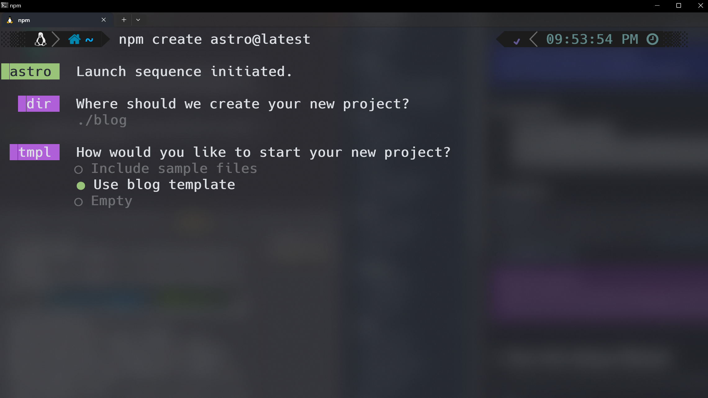
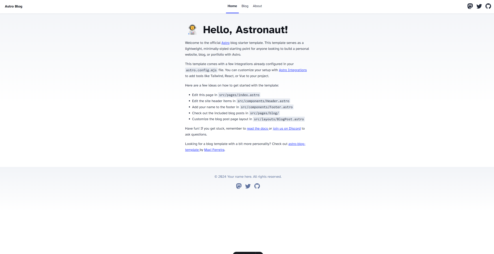
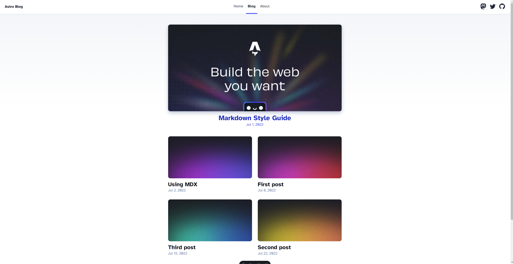

Right off the bat, I have to say, my developer experience with Astro has been outstanding! Although I'm just beginning to explore its depths, my interactions in the Discord server have been remarkable, with prompt and helpful responses from the community. Additionally, transitioning from React, I've found the adoption process to be quite smooth. The similarities in concepts and structure have made it easier to get accustomed to the new environment.

# Part I: Creating The Project

I began developing my first Astro project by entering this command in my terminal.
```
npm create astro@latest
```
Of course, I had already installed the right node version (v18.14.1 or higher) and opened up my editor and terminal, which are prerequisites for any Astro project.

Astro's Command Line Interface (CLI) guided me through the initial setup, asking me to name the project and handle the dependencies installation. Additionally, it offered the choice to initiate with a blog template. This template would serve as a pre-configured foundation for the project, offering a well-structured starting point for web development and design, effectively streamlining the building process.



What's unique about this project is its features:

- ✅ Minimal styling
- ✅ 100/100 Lighthouse score
- ✅ SEO-friendly
- ✅ Sitemap support
- ✅ RSS Feed
- ✅ Markdown & MDX support
 
Right from the start, Astro provided me with a user-friendly sandbox environment. This setup allowed me to experiment and learn, requiring minimal expertise in HTML, CSS, or JavaScript. I quickly had my initial project up and running, accessible at http://localhost:4321/.

<hr style="border: none; height: 10px; background: linear-gradient(to right, #f06, #a2d); border-radius: 5px;" />



<hr style="border: none; height: 10px; background: linear-gradient(to right, #f06, #a2d); border-radius: 5px;" />


<hr style="border: none; height: 10px; background: linear-gradient(to right, #f06, #a2d); border-radius: 5px;" />




# Part II: Astro Blog Template

As I navigated back to VS Code, I began to investigate the project structure. Here's what I found in the `src` folder.
```plaintext
project-root
┣ 📂components
┃ ┣ 📜BaseHead.astro
┃ ┣ 📜Footer.astro
┃ ┣ 📜FormattedDate.astro
┃ ┣ 📜Header.astro
┃ ┗ 📜HeaderLink.astro
┣ 📂content
┃ ┣ 📂blog
┃ ┃ ┣ 📜first-post.md
┃ ┃ ┣ 📜markdown-style-guide.md
┃ ┃ ┣ 📜second-post.md
┃ ┃ ┣ 📜third-post.md
┃ ┃ ┗ 📜using-mdx.mdx
┃ ┗ 📜config.ts
┣ 📂layouts
┃ ┗ 📜BlogPost.astro
┣ 📂pages
┃ ┣ 📂blog
┃ ┃ ┣ 📜[...slug].astro
┃ ┃ ┗ 📜index.astro
┃ ┣ 📜about.astro
┃ ┣ 📜index.astro
┃ ┗ 📜rss.xml.js
┣ 📂styles
┃ ┗ 📜global.css
┣ 📜consts.ts
┗ 📜env.d.ts
```

Components Folder (`components`):

Immediately noticeable in the Astro template is the components folder. It's a collection of essential UI elements like headers, footers, and other reusable components. This setup reflects Astro’s approach to organizing key parts of a website for efficient reuse and modular development.

Content Management (`content`):

The content folder is next in line, hosting all blog posts in Markdown format. This clear separation of content from the layout underscores Astro's philosophy of maintaining an organized and manageable structure, enhancing the ease of content creation and maintenance.

Layout Templates (`layouts`):

In the layouts folder, there's a specific file, such as BlogPost.astro, serving as a reusable layout template. This template provides a consistent structure for blog pages, allowing for customization and flexible design adaptations.

Page Structure (`pages`):

Diving into the pages directory reveals individual .astro files for different sections of the site, like the landing page (index.astro) and an 'about' page (about.astro), along with a blog folder for blog-specific pages.
Each Astro page file integrates three core components:
1. **Front Matter**: For metadata and script logic.
2. **HTML/JSX Markup**: The primary content area, blending HTML with dynamic JSX.
3. **Styling**: Scoped CSS within the same file or imported from external sources.

Styles Folder (`styles`):

The styles folder contains global styling files, like global.css. This is where you define CSS styles that apply across your entire site. Having a dedicated folder for styles helps in maintaining a clean and organized codebase, making it easier to manage and update your website's look and feel.

TypeScript Files (`consts.ts` and `env.d.ts`):

The consts.ts file stores constants like site settings, aiding in code reusability. The env.d.ts file, for TypeScript, ensures proper use of environment variables. While not essential right now, both files are useful for future scalability and code organization, according to ChatGPT.

# Part III: Building Off The Template

What really accelerated my progress building out this blog was utilizing the VS Code search feature, which allowed me to locate specific keywords or phrases within the repository. This tool was crucial in quickly identifying files and code segments I needed to modify, enabling me to tailor my blog and set it apart from the standard Astro blog template.

Here are some of the changes I made to peronalize my blog.


though was a little trick I learned a few years ago, which is how to search a projects code in VS Code. For example, when you type **ctrl + shift + f** in the explorer you can search any code in your project, and your query will return all the files and code tonatiaining that phrase. 

What's particularly striking about Astro's structure is its clear segmentation into three distinct components: the front matter, styling, and JSX. This separation enhances the overall clarity and organization of the development process.

This post is written in MDX, a markup syntax that blends Markdown and JSX, allowing you to write JSX in your Markdown documents. By its original design, MDX is closely tied to React because it allows embedding JSX directly within Markdown content. However, the concept of combining markup with components can be extended to other frameworks, including SolidJS, which is a declarative JavaScript library for building user interfaces.


 It's designed to bring the power of components to Markdown, making it possible to use React components within your content. This combination enables more interactive and dynamic content creation for websites, particularly those built with static site generators or React-based frameworks.